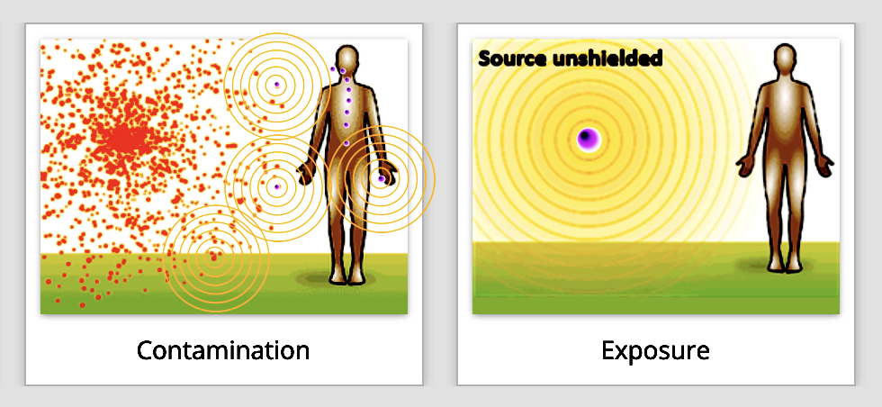

##### Last Update: June 15 2022 • TEPCO's suggested public comment period closes on June 17, 2022 Disclaimer: This essay is not about the efficacy of nuclear energy. It focuses only on the Fukushima Decommissioning Project.

# Overview
#### This is a health and safety analysis of the potential risk of the proposed radioactive water discharge into the Pacific Ocean. From the time since the Fukushima reactor meltdown in 2011, contamination has been detected in plants and animals in California alone, ranging from fish ([2012, Stanford](https://news.stanford.edu/news/2012/may/tuna-radioactive-materials-053012.html)) to wine ([2018, CNN](https://edition.cnn.com/2018/07/23/health/california-wine-radioactive-fukushima-trnd/index.html)). GEOMAR computer models show the spread of highly diluted radionuclides would reach U.S. borders in just 5 months. 

SOURCE: [https://www.geomar.de/en/news/article/fukushima-the-fate-of-contaminated-waters](https://www.geomar.de/en/news/article/fukushima-the-fate-of-contaminated-waters)

# Background 
Fukushima Daiichi is one of the largest nuclear meltdowns in history. Currently there are 1.3 million tons of radioactive water stored in tanks near the site of the meltdown. Business implications, including storage costs and real estate implications, have been cited as the reason for a new plan to discharge the tanks into the Pacific Ocean.
 
SOURCE: [https://en.wikipedia.org/wiki/Comparison_of_the_Chernobyl_and_Fukushima_nuclear_accidents](https://en.wikipedia.org/wiki/Comparison_of_the_Chernobyl_and_Fukushima_nuclear_accidents)

## Dispersal of radionuclides
Radioactive contamination of the environment by dispersal of radionuclides is much more hazardous and insidious than exposure to a localized radiation source. If the radionuclides enter the water supply and food supply they will continue to emit radiation for hundreds of years.
 
SOURCE: [https://remm.hhs.gov/index.html](https://remm.hhs.gov/index.html)

## Unknowns, Potential Risks and Side effects 
Official plans released by TEPCO explicitly schedule dumping treated radioactive water into the Pacific Ocean. This process will take 30 years of constant discharge into the Ocean. The reports also include expected radiation dose projections for the population. Environmental groups pointed out in 2021 that TEPCO's water treatment technology (ALPS) could not remove tritium or many other radioactive isotopes.
 
SOURCE: [docs/assets/reports/report_1_review_mission_to_tepco_and_meti.pdf](docs/assets/reports/report_1_review_mission_to_tepco_and_meti.pdf)

# Solutions and Recommendations 
### [University of Hawaii Recommendation](https://www.hawaii.edu/news/2022/05/02/treated-nuclear-wastewater-dump)
### [Fairewinds Energy Recommendation](https://www.fairewinds.org/fairewinds-recomendation-for-fukushima/?rq=Fairewinds%20reco)
### [Greenpeace Recommendation](https://www.greenpeace.org/static/planet4-japan-stateless/2021/03/ff71ab0b-finalfukushima2011-2020_web.pdf)
### [Fungi Remediation Recommendation](https://sign.moveon.org/petitions/implement-paul-stamets)
### [Gelatin Preservation Recommendation](https://gelatin1 )
#### International Academic Competitions Utilizing experimental solutions. 
#### Increased and continous uninterupted access for IAEA inspectors at all significant active reactors near the Ocean. 

## International Law
"hailed by environmentalists as a turning point in the protection of the world's oceans, the United States and 36 other governments voted yesterday to impose a permanent, legally binding ban on the dumping of all types of radioactive waste at sea." - [New York Times](https://www.nytimes.com/1993/11/13/world/nations-back-ban-on-atomic-dumping.html)
While modern micro nuclear reactors offer unprecedented power density and operational capabilities which are the future of many exciting applications, including high speed space travel and interplanetary human expansion, international laws help to ensure a safe and healthy environment for humans and animals and future generations. The passing of this agreement represented the best of international colaboration and proved that safe nuclear power and healthy oceans could coexist. It is time to reaffirm this commitment to our children and future generations. The most important component of this commitment is the [Precautionary principle](https://en.wikipedia.org/wiki/Precautionary_principle) in any context there is a possibility for the damage to be irreversible. 

London Convention: [docs/assets/reports/london_convention_pdf.pdf](docs/assets/reports/london_convention_pdf.pdf)

## Essence of life
Marine plants produce over 70% of our oxygen. Aquatic invertebrates constitute approximately 90% of life on the planet and play a vital role in ecosystem function. The ocean is critically important in our strategy to solve Climate Change. Irreversibly contaminating the entire Ocean with radioactive materials undermines ecological stability.

 
## Generational Effects
Scientists studying marine wildlife around the reactor site are concerned about the effects of radioactive waste on the aquatic environment. Despite claims that these radionuclides will be diluted and therefore, present in only small quantities, these do not account for the accumulation of radionuclides in consumers higher up in the food chain, including humans. Lab studies have also presented evidence for DNA damage to marine wildlife from extended exposure to radioactive particles, especially those which include the same isotopes as ones found at the Fukushima reactor site. These affected wildlife, some of which are mobile, will then have cascading effects on the environment if mutations are passed on through generations of breeding.

## Sources 
All the hard and valuable work in this document was completed and made possible by GEOMAR, Greenpeace, Stanford University, SFGate, Fairewinds Energy Education, New York Times. All linked in original form with PDFs in the CDN for convenient loading.

# Resources: 
"Tuna caught off California carry radiation from the Japanese disaster, Stanford scientist finds" 
https://news.stanford.edu/news/2012/may/tuna-radioactive-materials-053012.html

"Scientists say impact of long term low-dose [radiation] exposure to the environment and humans are unknown, and that tritium can have a bigger impact on humans when consumed in fish than in water."
https://www.sfgate.com/news/article/Japan-OKs-plan-to-release-Fukushima-nuclear-plant-17180803.php

"Fukushima Radiation Detected Off California Coast"
https://www.iflscience.com/harmless-levels-fukushima-radiation-detected-california-coast-26283

"Tests of milk samples taken last week in Spokane, Washington., indicate the presence of radioactive iodine from the troubled Fukushima Daiichi nuclear plant in Japan " 
https://www.nytimes.com/2011/03/31/us/31milk.html

### Greenpeace Summary
[https://www.greenpeace.org/static/planet4-japan-stateless/2021/12/9a52607f-public-comment-on-fukushima-radiological-assessment-.pdf](https://www.greenpeace.org/static/planet4-japan-stateless/2021/12/9a52607f-public-comment-on-fukushima-radiological-assessment-.pdf)

### Fairewinds Recommendations:
[https://www.fairewinds.org/fairewinds-recomendation-for-fukushima/?rq=Fairewinds%20reco](https://www.fairewinds.org/fairewinds-recomendation-for-fukushima/?rq=Fairewinds%20reco)

### University of Hawaii Recommendations:
[https://www.hawaii.edu/news/2022/05/02/treated-nuclear-wastewater-dump](https://www.hawaii.edu/news/2022/05/02/treated-nuclear-wastewater-dump)

### Science 
[https://www.science.org/doi/10.1126/science.abc1507](https://www.science.org/doi/10.1126/science.abc1507)

### Official TEPCO AFPS Water Treatment Plan:
[https://www.iaea.org/sites/default/files/report_1_review_mission_to_tepco_and_meti.pdf](https://www.iaea.org/sites/default/files/report_1_review_mission_to_tepco_and_meti.pdf)

### Official TEPCO Decomissioning site:
[https://www.tepco.co.jp/en/hd/responsibility/index-e.html](https://www.tepco.co.jp/en/hd/responsibility/index-e.html)

### Impact of Radioactive Wastewater on Marine Life
[https://theconversation.com/nuclear-power-how-might-radioactive-waste-water-affect-the-environment-159483](https://theconversation.com/nuclear-power-how-might-radioactive-waste-water-affect-the-environment-159483)

### Fukushima: Contaminated water could damage human DNA
[https://www.bbc.com/news/world-asia-54658379](https://www.bbc.com/news/world-asia-54658379)

### Overview by Greenpeace 

[https://www.greenpeace.org/static/planet4-japan-stateless/2021/03/ff71ab0b-finalfukushima2011-2020_web.pdf](https://www.greenpeace.org/static/planet4-japan-stateless/2021/03/ff71ab0b-finalfukushima2011-2020_web.pdf)

### 3D Animated Reactor Overview
[https://www.youtube.com/watch?v=YBNFvZ6Vr2U](https://www.youtube.com/watch?v=YBNFvZ6Vr2U)

