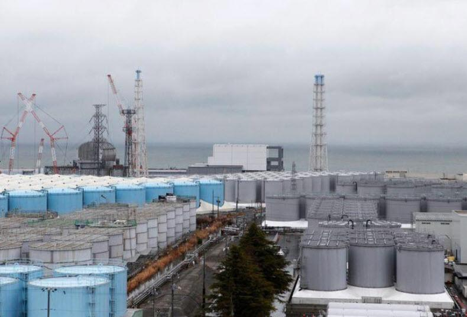

# Summary
In a few months, Japan proposes to dump all radioactive wastewater from the Fukushima disaster directly into the Pacific Ocean.
This decision would affect residents of the USA and the whole world. Dumping radioactive waste into the ocean was banned in 1972 ( The London Convention )
This article does not question or debate the efficacy of Nuclear Energy , but rather emphasise our long understood responsibility to safely store the nuclear waste in line with the London Convention. 

# Background
Currently there is 1.3 million tons of radioactive water stored in tanks near the site of the original disaster. The process took 11 years and $178 B USD 

### Summary 

### Summary of Risks

### Combinatorial Effects
Ocean filled with thousands of synthetic chemicals.  Need extensive testing. Pefect opportunity with large isolated equally divided tanks. 

### Top Proposals 
-- concrete lake
-- evaporation
